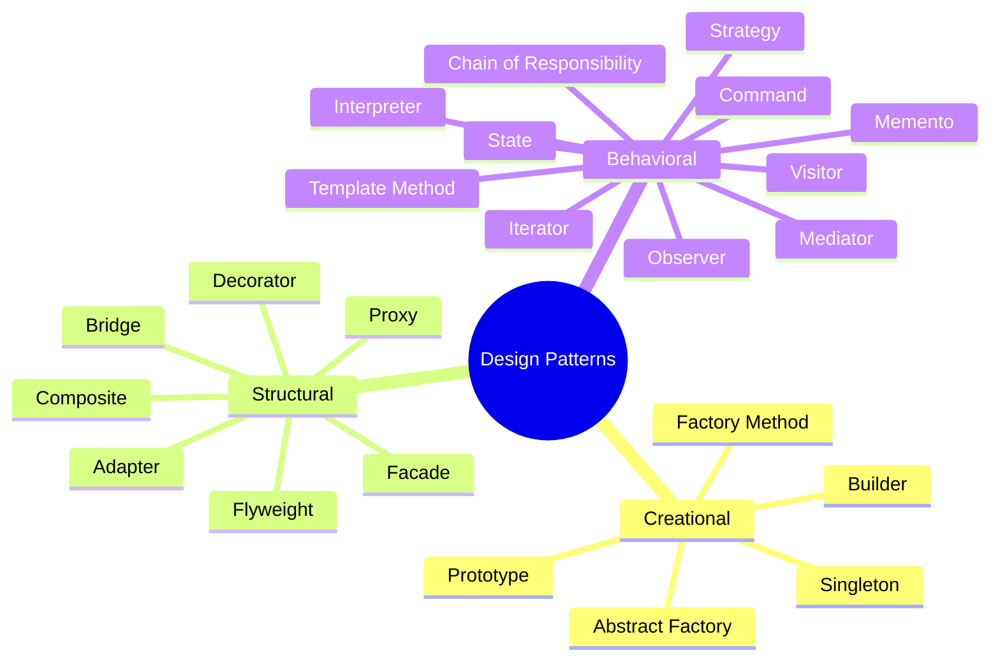

markdown
# Design Patterns - 주식 자동매매 시스템 적용 가이드

## 📋 목차
1. [개요](#개요)
2. [Creational Patterns (생성 패턴)](#creational-patterns-생성-패턴)
3. [Structural Patterns (구조 패턴)](#structural-patterns-구조-패턴)
4. [Behavioral Patterns (행위 패턴)](#behavioral-patterns-행위-패턴)
5. [프로젝트 적용 요약](#프로젝트-적용-요약)

---

## 개요

GoF(Gang of Four) 디자인 패턴 23가지를 주식 자동매매 시스템 개발에 적용하는 실용적인 가이드입니다.

### 패턴 분류



---

## CREATIONAL PATTERNS (생성 패턴)

객체 생성 메커니즘을 다루는 패턴으로, 객체 생성의 복잡도를 줄이고 유연성을 높입니다.

---

### 1. Factory Method (팩토리 메서드)

**목적**: 객체 생성을 서브클래스에 위임

**주식 시스템 적용 사례**: 다양한 주문 타입 생성

```csharp
// 추상 팩토리
public abstract class OrderFactory
{
    public abstract IOrder CreateOrder();
}

// 구체적인 팩토리들
public class MarketOrderFactory : OrderFactory
{
    public override IOrder CreateOrder()
    {
        return new MarketOrder();
    }
}

public class LimitOrderFactory : OrderFactory
{
    public override IOrder CreateOrder()
    {
        return new LimitOrder();
    }
}

public class StopOrderFactory : OrderFactory
{
    public override IOrder CreateOrder()
    {
        return new StopOrder();
    }
}

// 사용 예시
public class TradingService
{
    public IOrder PlaceOrder(OrderFactory factory, OrderDetails details)
    {
        var order = factory.CreateOrder();
        order.SetDetails(details);
        return order;
    }
}
```

**장점**:
- 새로운 주문 타입 추가 시 기존 코드 수정 불필요
- 객체 생성 로직의 캡슐화

---

### 2. Abstract Factory (추상 팩토리)

**목적**: 관련된 객체들의 패밀리를 생성

**주식 시스템 적용 사례**: 증권사별 API 클라이언트 생성

```csharp
// 추상 팩토리 인터페이스
public interface IBrokerFactory
{
    IOrderClient CreateOrderClient();
    IMarketDataClient CreateMarketDataClient();
    IAccountClient CreateAccountClient();
}

// 키움증권 팩토리
public class KiwoomFactory : IBrokerFactory
{
    public IOrderClient CreateOrderClient()
    {
        return new KiwoomOrderClient();
    }
    
    public IMarketDataClient CreateMarketDataClient()
    {
        return new KiwoomMarketDataClient();
    }
    
    public IAccountClient CreateAccountClient()
    {
        return new KiwoomAccountClient();
    }
}

// 한국투자증권 팩토리
public class KoreaInvestmentFactory : IBrokerFactory
{
    public IOrderClient CreateOrderClient()
    {
        return new KoreaInvestmentOrderClient();
    }
    
    public IMarketDataClient CreateMarketDataClient()
    {
        return new KoreaInvestmentMarketDataClient();
    }
    
    public IAccountClient CreateAccountClient()
    {
        return new KoreaInvestmentAccountClient();
    }
}

// 사용 예시
public class BrokerService
{
    private readonly IBrokerFactory _factory;
    
    public BrokerService(IBrokerFactory factory)
    {
        _factory = factory;
    }
    
    public void Initialize()
    {
        var orderClient = _factory.CreateOrderClient();
        var marketClient = _factory.CreateMarketDataClient();
        var accountClient = _factory.CreateAccountClient();
    }
}
```

**장점**:
- 증권사 변경 시 팩토리만 교체하면 됨
- 관련 객체들의 일관성 보장

---

### 3. Builder (빌더)

**목적**: 복잡한 객체의 단계별 생성

**주식 시스템 적용 사례**: 복잡한 주문 생성

```csharp
public class OrderBuilder
{
    private string _stockCode;
    private OrderType _orderType;
    private OrderSide _orderSide;
    private decimal _price;
    private int _quantity;
    private decimal? _stopLoss;
    private decimal? _takeProfit;
    private bool _useTrailingStop;
    private string _strategyId;
    
    public OrderBuilder SetStock(string stockCode)
    {
        _stockCode = stockCode;
        return this;
    }
    
    public OrderBuilder SetType(OrderType orderType)
    {
        _orderType = orderType;
        return this;
    }
    
    public OrderBuilder SetSide(OrderSide side)
    {
        _orderSide = side;
        return this;
    }
    
    public OrderBuilder SetPrice(decimal price)
    {
        _price = price;
        return this;
    }
    
    public OrderBuilder SetQuantity(int quantity)
    {
        _quantity = quantity;
        return this;
    }
    
    public OrderBuilder WithStopLoss(decimal stopLoss)
    {
        _stopLoss = stopLoss;
        return this;
    }
    
    public OrderBuilder WithTakeProfit(decimal takeProfit)
    {
        _takeProfit = takeProfit;
        return this;
    }
    
    public OrderBuilder WithTrailingStop()
    {
        _useTrailingStop = true;
        return this;
    }
    
    public OrderBuilder ForStrategy(string strategyId)
    {
        _strategyId = strategyId;
        return this;
    }
    
    public Order Build()
    {
        var order = new Order
        {
            StockCode = _stockCode,
            OrderType = _orderType,
            OrderSide = _orderSide,
            Price = _price,
            Quantity = _quantity,
            StopLoss = _stopLoss,
            TakeProfit = _takeProfit,
            UseTrailingStop = _useTrailingStop,
            StrategyId = _strategyId
        };
        
        order.Validate();
        return order;
    }
}

// 사용 예시
var order = new OrderBuilder()
    .SetStock(\"005930\")
    .SetType(OrderType.Limit)
    .SetSide(OrderSide.Buy)
    .SetPrice(70000)
    .SetQuantity(10)
    .WithStopLoss(68000)
    .WithTakeProfit(75000)
    .ForStrategy(\"MA_CROSS_STRATEGY\")
    .Build();
```

**장점**:
- 복잡한 객체 생성 과정을 명확하게 표현
- 불변 객체 생성에 유용
- 유효성 검증을 Build() 단계에서 수행

---

### 4. Prototype (프로토타입)

**목적**: 기존 객체를 복제하여 새 객체 생성

**주식 시스템 적용 사례**: 전략 복제 및 백테스트

```csharp
public interface IPrototype<T>
{
    T Clone();
}

public class TradingStrategy : IPrototype<TradingStrategy>
{
    public string Name { get; set; }
    public Dictionary<string, object> Parameters { get; set; }
    public List<string> WatchList { get; set; }
    public RiskConfig RiskConfig { get; set; }
    
    public TradingStrategy Clone()
    {
        return new TradingStrategy
        {
            Name = this.Name + \"_Copy\",
            Parameters = new Dictionary<string, object>(this.Parameters),
            WatchList = new List<string>(this.WatchList),
            RiskConfig = this.RiskConfig.Clone()
        };
    }
}

// 사용 예시
public class StrategyService
{
    public TradingStrategy CreateVariant(TradingStrategy baseStrategy, 
        Dictionary<string, object> newParameters)
    {
        var variant = baseStrategy.Clone();
        
        // 파라미터만 변경
        foreach (var param in newParameters)
        {
            variant.Parameters[param.Key] = param.Value;
        }
        
        return variant;
    }
    
    public async Task<List<BacktestResult>> OptimizeStrategy(
        TradingStrategy baseStrategy)
    {
        var results = new List<BacktestResult>();
        
        // 다양한 파라미터 조합으로 전략 복제 및 백테스트
        for (int ma1 = 5; ma1 <= 20; ma1 += 5)
        {
            for (int ma2 = 20; ma2 <= 60; ma2 += 10)
            {
                var variant = baseStrategy.Clone();
                variant.Parameters[\"ShortMA\"] = ma1;
                variant.Parameters[\"LongMA\"] = ma2;
                
                var result = await BacktestAsync(variant);
                results.Add(result);
            }
        }
        
        return results;
    }
}
```

**장점**:
- 객체 생성 비용 절감
- 파라미터 최적화 시 유용

---

### 5. Singleton (싱글톤)

**목적**: 클래스의 인스턴스가 오직 하나만 존재하도록 보장

**주식 시스템 적용 사례**: API 연결, 설정 관리

```csharp
// Thread-safe Singleton
public sealed class KiwoomApiConnection
{
    private static readonly Lazy<KiwoomApiConnection> _instance = 
        new Lazy<KiwoomApiConnection>(() => new KiwoomApiConnection());
    
    public static KiwoomApiConnection Instance => _instance.Value;
    
    private bool _isConnected;
    
    private KiwoomApiConnection()
    {
        // 초기화 로직
    }
    
    public async Task ConnectAsync()
    {
        if (_isConnected)
            return;
        
        // API 연결 로직
        _isConnected = true;
    }
    
    public void Disconnect()
    {
        if (!_isConnected)
            return;
        
        // 연결 해제 로직
        _isConnected = false;
    }
}

// 사용 예시
public class TradingService
{
    public async Task InitializeAsync()
    {
        var api = KiwoomApiConnection.Instance;
        await api.ConnectAsync();
    }
}

// DI 컨테이너를 사용한 더 나은 방법 (권장)
public class Startup
{
    public void ConfigureServices(IServiceCollection services)
    {
        // Singleton 등록
        services.AddSingleton<IKiwoomApiConnection, KiwoomApiConnection>();
        services.AddSingleton<IConfigurationManager, ConfigurationManager>();
    }
}
```

**장점**:
- 리소스 공유 (API 연결, 설정 등)
- 전역 접근점 제공

**주의사항**:
- 테스트 어려움
- 가능하면 DI 컨테이너 활용 권장

---

## STRUCTURAL PATTERNS (구조 패턴)

클래스와 객체를 조합하여 더 큰 구조를 만드는 패턴입니다.

---

### 6. Adapter (어댑터)

**목적**: 호환되지 않는 인터페이스를 연결

**주식 시스템 적용 사례**: 외부 API 통합

```csharp
// 타겟 인터페이스
public interface IMarketDataProvider
{
    Task<StockPrice> GetCurrentPriceAsync(string stockCode);
    Task<List<OHLCV>> GetHistoricalDataAsync(string stockCode, DateTime from, DateTime to);
}

// 어댑티 (기존 키움 API)
public class KiwoomOpenApi
{
    public string GetStockPrice(string code)
    {
        // 키움 API 호출 (문자열 반환)
        return \"70000|71000|69000|70500|1000000\";
    }
    
    public List<string> GetChartData(string code, string startDate, string endDate)
    {
        // 키움 형식 데이터 반환
        return new List<string>();
    }
}

// 어댑터
public class KiwoomMarketDataAdapter : IMarketDataProvider
{
    private readonly KiwoomOpenApi _kiwoomApi;
    
    public KiwoomMarketDataAdapter(KiwoomOpenApi kiwoomApi)
    {
        _kiwoomApi = kiwoomApi;
    }
    
    public async Task<StockPrice> GetCurrentPriceAsync(string stockCode)
    {
        var rawData = _kiwoomApi.GetStockPrice(stockCode);
        var parts = rawData.Split('|');
        
        return new StockPrice
        {
            Open = decimal.Parse(parts[0]),
            High = decimal.Parse(parts[1]),
            Low = decimal.Parse(parts[2]),
            Close = decimal.Parse(parts[3]),
            Volume = long.Parse(parts[4])
        };
    }
    
    public async Task<List<OHLCV>> GetHistoricalDataAsync(
        string stockCode, DateTime from, DateTime to)
    {
        var rawData = _kiwoomApi.GetChartData(
            stockCode, 
            from.ToString(\"yyyyMMdd\"), 
            to.ToString(\"yyyyMMdd\"));
        
        // 데이터 변환 로직
        return ConvertToOHLCV(rawData);
    }
    
    private List<OHLCV> ConvertToOHLCV(List<string> rawData)
    {
        // 변환 로직
        return new List<OHLCV>();
    }
}

// 사용 예시
public class ChartService
{
    private readonly IMarketDataProvider _marketData;
    
    public ChartService(IMarketDataProvider marketData)
    {
        _marketData = marketData; // 어떤 구현체든 사용 가능
    }
    
    public async Task<Chart> GenerateChartAsync(string stockCode)
    {
        var data = await _marketData.GetHistoricalDataAsync(
            stockCode, 
            DateTime.Now.AddMonths(-1), 
            DateTime.Now);
        
        return CreateChart(data);
    }
}
```

**장점**:
- 기존 코드 수정 없이 새로운 인터페이스 통합
- 다양한 증권사 API 통합 용이

---

### 7. Bridge (브리지)

**목적**: 추상화와 구현을 분리하여 독립적으로 변경 가능

**주식 시스템 적용 사례**: 알림 시스템

```csharp
// 구현부 인터페이스
public interface INotificationSender
{
    Task SendAsync(string message);
}

// 구체적인 구현들
public class EmailNotificationSender : INotificationSender
{
    public async Task SendAsync(string message)
    {
        // 이메일 전송 로직
        Console.WriteLine($\"Email: {message}\");
    }
}

public class SmsNotificationSender : INotificationSender
{
    public async Task SendAsync(string message)
    {
        // SMS 전송 로직
        Console.WriteLine($\"SMS: {message}\");
    }
}

public class TelegramNotificationSender : INotificationSender
{
    public async Task SendAsync(string message)
    {
        // 텔레그램 전송 로직
        Console.WriteLine($\"Telegram: {message}\");
    }
}

// 추상화부
public abstract class Notification
{
    protected INotificationSender _sender;
    
    protected Notification(INotificationSender sender)
    {
        _sender = sender;
    }
    
    public abstract Task SendAsync();
}

// 구체적인 알림들
public class OrderExecutedNotification : Notification
{
    private readonly Order _order;
    
    public OrderExecutedNotification(Order order, INotificationSender sender) 
        : base(sender)
    {
        _order = order;
    }
    
    public override async Task SendAsync()
    {
        var message = $\"주문 체결: {_order.StockCode} {_order.Quantity}주 @ {_order.Price:N0}원\";
        await _sender.SendAsync(message);
    }
}

public class RiskAlertNotification : Notification
{
    private readonly RiskAlert _alert;
    
    public RiskAlertNotification(RiskAlert alert, INotificationSender sender) 
        : base(sender)
    {
        _alert = alert;
    }
    
    public override async Task SendAsync()
    {
        var message = $\"⚠️ 리스크 경고: {_alert.Message}\";
        await _sender.SendAsync(message);
    }
}

// 사용 예시
public class NotificationService
{
    public async Task NotifyOrderExecuted(Order order, List<string> channels)
    {
        foreach (var channel in channels)
        {
            INotificationSender sender = channel switch
            {
                \"email\" => new EmailNotificationSender(),
                \"sms\" => new SmsNotificationSender(),
                \"telegram\" => new TelegramNotificationSender(),
                _ => throw new ArgumentException($\"Unknown channel: {channel}\")
            };
            
            var notification = new OrderExecutedNotification(order, sender);
            await notification.SendAsync();
        }
    }
}
```

**장점**:
- 알림 타입과 전송 방법을 독립적으로 확장
- 새로운 알림 타입이나 채널 추가 용이

---

### 8. Composite (컴포지트)

**목적**: 객체들을 트리 구조로 구성하여 부분-전체 계층 표현

**주식 시스템 적용 사례**: 포트폴리오 구조

```csharp
// Component
public abstract class PortfolioComponent
{
    public string Name { get; set; }
    
    public abstract decimal GetTotalValue();
    public abstract List<Position> GetAllPositions();
    public abstract void Add(PortfolioComponent component);
    public abstract void Remove(PortfolioComponent component);
}

// Leaf
public class Position : PortfolioComponent
{
    public string StockCode { get; set; }
    public int Quantity { get; set; }
    public decimal CurrentPrice { get; set; }
    
    public override decimal GetTotalValue()
    {
        return Quantity * CurrentPrice;
    }
    
    public override List<Position> GetAllPositions()
    {
        return new List<Position> { this };
    }
    
    public override void Add(PortfolioComponent component)
    {
        throw new InvalidOperationException(\"Cannot add to a position\");
    }
    
    public override void Remove(PortfolioComponent component)
    {
        throw new InvalidOperationException(\"Cannot remove from a position\");
    }
}

// Composite
public class Portfolio : PortfolioComponent
{
    private List<PortfolioComponent> _components = new();
    
    public override decimal GetTotalValue()
    {
        return _components.Sum(c => c.GetTotalValue());
    }
    
    public override List<Position> GetAllPositions()
    {
        var positions = new List<Position>();
        foreach (var component in _components)
        {
            positions.AddRange(component.GetAllPositions());
        }
        return positions;
    }
    
    public override void Add(PortfolioComponent component)
    {
        _components.Add(component);
    }
    
    public override void Remove(PortfolioComponent component)
    {
        _components.Remove(component);
    }
}

// 사용 예시
var mainPortfolio = new Portfolio { Name = \"전체 포트폴리오\" };

var techPortfolio = new Portfolio { Name = \"IT 포트폴리오\" };
techPortfolio.Add(new Position { Name = \"삼성전자\", StockCode = \"005930\", Quantity = 10, CurrentPrice = 70000 });
techPortfolio.Add(new Position { Name = \"SK하이닉스\", StockCode = \"000660\", Quantity = 5, CurrentPrice = 120000 });

var financePortfolio = new Portfolio { Name = \"금융 포트폴리오\" };
financePortfolio.Add(new Position { Name = \"KB금융\", StockCode = \"105560\", Quantity = 20, CurrentPrice = 50000 });

mainPortfolio.Add(techPortfolio);
mainPortfolio.Add(financePortfolio);

decimal totalValue = mainPortfolio.GetTotalValue();
Console.WriteLine($\"전체 포트폴리오 가치: {totalValue:N0}원\");
```

**장점**:
- 계층 구조를 일관되게 처리
- 새로운 포트폴리오 타입 추가 용이

---

### 9. Decorator (데코레이터)

**목적**: 객체에 동적으로 새로운 기능 추가

**주식 시스템 적용 사례**: 주문 검증 및 로깅

```csharp
// Component
public interface IOrderProcessor
{
    Task<OrderResult> ProcessOrderAsync(Order order);
}

// ConcreteComponent
public class BasicOrderProcessor : IOrderProcessor
{
    public async Task<OrderResult> ProcessOrderAsync(Order order)
    {
        // 기본 주문 처리 로직
        return new OrderResult { Success = true, OrderId = order.OrderId };
    }
}

// Decorator
public abstract class OrderProcessorDecorator : IOrderProcessor
{
    protected IOrderProcessor _processor;
    
    protected OrderProcessorDecorator(IOrderProcessor processor)
    {
        _processor = processor;
    }
    
    public virtual async Task<OrderResult> ProcessOrderAsync(Order order)
    {
        return await _processor.ProcessOrderAsync(order);
    }
}

// ConcreteDecorators
public class ValidationDecorator : OrderProcessorDecorator
{
    public ValidationDecorator(IOrderProcessor processor) : base(processor) { }
    
    public override async Task<OrderResult> ProcessOrderAsync(Order order)
    {
        // 사전 검증
        if (order.Quantity <= 0)
            return new OrderResult { Success = false, Error = \"수량은 0보다 커야 합니다\" };
        
        if (order.Price <= 0)
            return new OrderResult { Success = false, Error = \"가격은 0보다 커야 합니다\" };
        
        return await base.ProcessOrderAsync(order);
    }
}

public class LoggingDecorator : OrderProcessorDecorator
{
    private readonly ILogger _logger;
    
    public LoggingDecorator(IOrderProcessor processor, ILogger logger) 
        : base(processor)
    {
        _logger = logger;
    }
    
    public override async Task<OrderResult> ProcessOrderAsync(Order order)
    {
        _logger.LogInformation($\"주문 처리 시작: {order.OrderId}\");
        
        var result = await base.ProcessOrderAsync(order);
        
        _logger.LogInformation($\"주문 처리 완료: {order.OrderId}, 결과: {result.Success}\");
        
        return result;
    }
}

public class RiskCheckDecorator : OrderProcessorDecorator
{
    private readonly IRiskManager _riskManager;
    
    public RiskCheckDecorator(IOrderProcessor processor, IRiskManager riskManager) 
        : base(processor)
    {
        _riskManager = riskManager;
    }
    
    public override async Task<OrderResult> ProcessOrderAsync(Order order)
    {
        // 리스크 체크
        var riskCheck = await _riskManager.ValidateOrderAsync(order);
        if (!riskCheck.IsValid)
        {
            return new OrderResult 
            { 
                Success = false, 
                Error = $\"리스크 검증 실패: {riskCheck.Reason}\" 
            };
        }
        
        return await base.ProcessOrderAsync(order);
    }
}

// 사용 예시
public class TradingService
{
    public void ConfigureOrderProcessor()
    {
        // 기본 프로세서에 데코레이터들을 추가
        IOrderProcessor processor = new BasicOrderProcessor();
        processor = new ValidationDecorator(processor);
        processor = new RiskCheckDecorator(processor, new RiskManager());
        processor = new LoggingDecorator(processor, logger);
        
        // 이제 processor는 검증 + 리스크체크 + 로깅 기능을 모두 가짐
    }
}
```

**장점**:
- 기능을 동적으로 추가/제거
- 단일 책임 원칙 준수
- 다양한 조합 가능

---

### 10. Facade (파사드)

**목적**: 복잡한 서브시스템에 대한 단순한 인터페이스 제공

**주식 시스템 적용 사례**: 거래 시스템 통합 인터페이스

```csharp
// 복잡한 서브시스템들
public class OrderManagementSystem
{
    public void ValidateOrder(Order order) { }
    public void SubmitOrder(Order order) { }
}

public class PositionManagementSystem
{
    public void UpdatePosition(Order order) { }
    public Position GetPosition(string stockCode) { return new Position(); }
}

public class AccountManagementSystem
{
    public void DeductBalance(decimal amount) { }
    public void AddBalance(decimal amount) { }
    public decimal GetAvailableBalance() { return 0; }
}

public class RiskManagementSystem
{
    public bool CheckRiskLimits(Order order) { return true; }
    public void UpdateRiskMetrics() { }
}

public class NotificationSystem
{
    public void SendNotification(string message) { }
}

// Facade
public class TradingFacade
{
    private readonly OrderManagementSystem _orderSystem;
    private readonly PositionManagementSystem _positionSystem;
    private readonly AccountManagementSystem _accountSystem;
    private readonly RiskManagementSystem _riskSystem;
    private readonly NotificationSystem _notificationSystem;
    
    public TradingFacade()
    {
        _orderSystem = new OrderManagementSystem();
        _positionSystem = new PositionManagementSystem();
        _accountSystem = new AccountManagementSystem();
        _riskSystem = new RiskManagementSystem();
        _notificationSystem = new NotificationSystem();
    }
    
    // 간단한 인터페이스 제공
    public async Task<bool> PlaceOrderAsync(Order order)
    {
        try
        {
            // 1. 리스크 체크
            if (!_riskSystem.CheckRiskLimits(order))
            {
                _notificationSystem.SendNotification(\"리스크 한도 초과\");
                return false;
            }
            
            // 2. 잔고 확인
            var requiredAmount = order.Price * order.Quantity;
            if (_accountSystem.GetAvailableBalance() < requiredAmount)
            {
                _notificationSystem.SendNotification(\"잔고 부족\");
                return false;
            }
            
            // 3. 주문 검증
            _orderSystem.ValidateOrder(order);
            
            // 4. 잔고 차감
            _accountSystem.DeductBalance(requiredAmount);
            
            // 5. 주문 제출
            _orderSystem.SubmitOrder(order);
            
            // 6. 포지션 업데이트
            _positionSystem.UpdatePosition(order);
            
            // 7. 리스크 메트릭 업데이트
            _riskSystem.UpdateRiskMetrics();
            
            // 8. 알림 발송
            _notificationSystem.SendNotification($\"주문 완료: {order.StockCode}\");
            
            return true;
        }
        catch (Exception ex)
        {
            _notificationSystem.SendNotification($\"주문 실패: {ex.Message}\");
            return false;
        }
    }
}
```

**장점**:
- 복잡한 시스템을 간단하게 사용
- 서브시스템 간 의존성 감소

---

### 11. Flyweight (플라이웨이트)
**목적**: 많은 수의 객체를 효율적으로 공유
**주식 시스템 적용 사례**: 종목 정보 캐싱
```csharp
// Flyweight
public class StockInfo
{
    // 공유되는 내재 상태 (불변)
    public string StockCode { get; private set; }
    public string StockName { get; private set; }
    public string Market { get; private set; }
    public string Sector { get; private set; }
    
    public StockInfo(string stockCode, string stockName, string market, string sector)
    {
        StockCode = stockCode;
        StockName = stockName;
        Market = market;
        Sector = sector;
    }
    
    // 외재 상태를 매개변수로 받아 처리
    public void DisplayPrice(decimal currentPrice, long volume)
    {
        Console.WriteLine($"{StockName}({StockCode}): {currentPrice:N0}원, 거래량: {volume:N0}");
    }
}

// Flyweight Factory
public class StockInfoFactory
{
    private static readonly Dictionary<string, StockInfo> _stockPool = new();
    private static readonly object _lock = new object();
    
    public static StockInfo GetStockInfo(string stockCode)
    {
        lock (_lock)
        {
            if (_stockPool.ContainsKey(stockCode))
            {
                Console.WriteLine($"[캐시 히트] {stockCode}");
                return _stockPool[stockCode];
            }
            
            Console.WriteLine($"[캐시 미스] {stockCode} - 새로 생성");
            
            // 실제로는 DB나 API에서 조회
            var stockInfo = LoadStockInfoFromDatabase(stockCode);
            _stockPool[stockCode] = stockInfo;
            
            return stockInfo;
        }
    }
    
    private static StockInfo LoadStockInfoFromDatabase(string stockCode)
    {
        // DB 조회 로직
        return stockCode switch
        {
            "005930" => new StockInfo("005930", "삼성전자", "KOSPI", "반도체"),
            "000660" => new StockInfo("000660", "SK하이닉스", "KOSPI", "반도체"),
            _ => new StockInfo(stockCode, "Unknown", "KOSPI", "기타")
        };
    }
    
    public static int GetPoolSize() => _stockPool.Count;
}

// 사용 예시
public class MarketDataService
{
    public void ProcessRealtimeData(List<PriceUpdate> updates)
    {
        foreach (var update in updates)
        {
            // StockInfo는 공유되지만, 가격과 거래량은 매번 다름
            var stockInfo = StockInfoFactory.GetStockInfo(update.StockCode);
            stockInfo.DisplayPrice(update.Price, update.Volume);
        }
        
        Console.WriteLine($"총 캐시된 종목 수: {StockInfoFactory.GetPoolSize()}");
    }
}
```

**장점**:
- 메모리 사용량 대폭 감소
- 실시간 시세 처리 시 성능 향상
- 수천 개 종목 정보를 효율적으로 관리


### 12. Proxy (프록시)
**목적**: 다른 객체에 대한 대리자 역할
**주식 시스템 적용 사례**: API 호출 제한 및 캐싱
```csharp
// Subject
public interface IMarketDataService
{
    Task<StockPrice> GetStockPriceAsync(string stockCode);
    Task<List<OHLCV>> GetChartDataAsync(string stockCode, int days);
}

// RealSubject
public class RealMarketDataService : IMarketDataService
{
    public async Task<StockPrice> GetStockPriceAsync(string stockCode)
    {
        Console.WriteLine($"[실제 API 호출] {stockCode}의 현재가 조회");
        await Task.Delay(100); // API 호출 시뮬레이션
        
        return new StockPrice
        {
            StockCode = stockCode,
            CurrentPrice = 70000,
            Timestamp = DateTime.Now
        };
    }
    
    public async Task<List<OHLCV>> GetChartDataAsync(string stockCode, int days)
    {
        Console.WriteLine($"[실제 API 호출] {stockCode}의 {days}일 차트 데이터 조회");
        await Task.Delay(500);
        
        return new List<OHLCV>();
    }
}

// Proxy
public class CachedMarketDataProxy : IMarketDataService
{
    private readonly RealMarketDataService _realService;
    private readonly Dictionary<string, (StockPrice Price, DateTime CachedAt)> _priceCache;
    private readonly Dictionary<string, (List<OHLCV> Data, DateTime CachedAt)> _chartCache;
    private readonly TimeSpan _cacheDuration = TimeSpan.FromSeconds(5);
    private readonly SemaphoreSlim _rateLimiter;
    
    public CachedMarketDataProxy()
    {
        _realService = new RealMarketDataService();
        _priceCache = new Dictionary<string, (StockPrice, DateTime)>();
        _chartCache = new Dictionary<string, (List<OHLCV>, DateTime)>();
        _rateLimiter = new SemaphoreSlim(5, 5); // 동시 5개 요청 제한
    }
    
    public async Task<StockPrice> GetStockPriceAsync(string stockCode)
    {
        // 캐시 확인
        if (_priceCache.ContainsKey(stockCode))
        {
            var (cachedPrice, cachedAt) = _priceCache[stockCode];
            if (DateTime.Now - cachedAt < _cacheDuration)
            {
                Console.WriteLine($"[캐시 반환] {stockCode}");
                return cachedPrice;
            }
        }
        
        // Rate Limiting
        await _rateLimiter.WaitAsync();
        try
        {
            var price = await _realService.GetStockPriceAsync(stockCode);
            _priceCache[stockCode] = (price, DateTime.Now);
            return price;
        }
        finally
        {
            _rateLimiter.Release();
        }
    }
    
    public async Task<List<OHLCV>> GetChartDataAsync(string stockCode, int days)
    {
        var cacheKey = $"{stockCode}_{days}";
        
        if (_chartCache.ContainsKey(cacheKey))
        {
            var (cachedData, cachedAt) = _chartCache[cacheKey];
            if (DateTime.Now - cachedAt < TimeSpan.FromMinutes(5))
            {
                Console.WriteLine($"[차트 캐시 반환] {stockCode}");
                return cachedData;
            }
        }
        
        await _rateLimiter.WaitAsync();
        try
        {
            var data = await _realService.GetChartDataAsync(stockCode, days);
            _chartCache[cacheKey] = (data, DateTime.Now);
            return data;
        }
        finally
        {
            _rateLimiter.Release();
        }
    }
}

// 사용 예시
public class TradingApplication
{
    public async Task RunAsync()
    {
        IMarketDataService service = new CachedMarketDataProxy();
        
        // 같은 종목을 여러 번 조회해도 API는 한 번만 호출됨
        var price1 = await service.GetStockPriceAsync("005930");
        var price2 = await service.GetStockPriceAsync("005930"); // 캐시에서 반환
        var price3 = await service.GetStockPriceAsync("005930"); // 캐시에서 반환
    }
}
```

**장점**:
- API 호출 비용 절감
- Rate Limiting 구현
- 접근 제어
- 지연 로딩


## BEHAVIORAL PATTERNS (행위 패턴)
객체들 간의 상호작용과 책임 분배를 다루는 패턴입니다.

### 13. Chain of Responsibility (책임 연쇄)
**목적**: 요청을 처리할 객체를 찾을 때까지 체인을 따라 전달
**주식 시스템 적용 사례**: 주문 검증 파이프라인
```csharp
// Handler
public abstract class OrderValidator
{
    protected OrderValidator _nextValidator;
    
    public OrderValidator SetNext(OrderValidator validator)
    {
        _nextValidator = validator;
        return validator;
    }
    
    public abstract Task<ValidationResult> ValidateAsync(Order order);
}

// Concrete Handlers
public class BasicOrderValidator : OrderValidator
{
    public override async Task<ValidationResult> ValidateAsync(Order order)
    {
        Console.WriteLine("[1단계] 기본 검증");
        
        if (string.IsNullOrEmpty(order.StockCode))
            return ValidationResult.Fail("종목 코드가 없습니다");
        
        if (order.Quantity <= 0)
            return ValidationResult.Fail("수량은 0보다 커야 합니다");
        
        if (order.Price <= 0)
            return ValidationResult.Fail("가격은 0보다 커야 합니다");
        
        // 다음 검증자로 전달
        if (_nextValidator != null)
            return await _nextValidator.ValidateAsync(order);
        
        return ValidationResult.Success();
    }
}

public class BalanceValidator : OrderValidator
{
    private readonly IAccountService _accountService;
    
    public BalanceValidator(IAccountService accountService)
    {
        _accountService = accountService;
    }
    
    public override async Task<ValidationResult> ValidateAsync(Order order)
    {
        Console.WriteLine("[2단계] 잔고 검증");
        
        var balance = await _accountService.GetAvailableBalanceAsync();
        var requiredAmount = order.Price * order.Quantity;
        
        if (balance < requiredAmount)
            return ValidationResult.Fail($"잔고 부족 (필요: {requiredAmount:N0}원, 보유: {balance:N0}원)");
        
        if (_nextValidator != null)
            return await _nextValidator.ValidateAsync(order);
        
        return ValidationResult.Success();
    }
}

public class RiskLimitValidator : OrderValidator
{
    private readonly IRiskManager _riskManager;
    
    public RiskLimitValidator(IRiskManager riskManager)
    {
        _riskManager = riskManager;
    }
    
    public override async Task<ValidationResult> ValidateAsync(Order order)
    {
        Console.WriteLine("[3단계] 리스크 한도 검증");
        
        var currentRisk = await _riskManager.GetCurrentRiskScoreAsync();
        if (currentRisk > 80)
            return ValidationResult.Fail("리스크 점수가 너무 높습니다");
        
        var maxPositionSize = await _riskManager.GetMaxPositionSizeAsync();
        var orderAmount = order.Price * order.Quantity;
        
        if (orderAmount > maxPositionSize)
            return ValidationResult.Fail($"최대 포지션 크기 초과 (최대: {maxPositionSize:N0}원)");
        
        if (_nextValidator != null)
            return await _nextValidator.ValidateAsync(order);
        
        return ValidationResult.Success();
    }
}

public class TradingHoursValidator : OrderValidator
{
    public override async Task<ValidationResult> ValidateAsync(Order order)
    {
        Console.WriteLine("[4단계] 거래 시간 검증");
        
        var now = DateTime.Now.TimeOfDay;
        var marketOpen = new TimeSpan(9, 0, 0);
        var marketClose = new TimeSpan(15, 30, 0);
        
        if (now < marketOpen || now > marketClose)
            return ValidationResult.Fail("장 시간이 아닙니다");
        
        if (_nextValidator != null)
            return await _nextValidator.ValidateAsync(order);
        
        return ValidationResult.Success();
    }
}

// 사용 예시
public class OrderService
{
    private readonly OrderValidator _validatorChain;
    
    public OrderService(IAccountService accountService, IRiskManager riskManager)
    {
        // 검증 체인 구성
        var basicValidator = new BasicOrderValidator();
        var balanceValidator = new BalanceValidator(accountService);
        var riskValidator = new RiskLimitValidator(riskManager);
        var hoursValidator = new TradingHoursValidator();
        
        basicValidator
            .SetNext(balanceValidator)
            .SetNext(riskValidator)
            .SetNext(hoursValidator);
        
        _validatorChain = basicValidator;
    }
    
    public async Task<OrderResult> PlaceOrderAsync(Order order)
    {
        // 체인을 통한 검증
        var validationResult = await _validatorChain.ValidateAsync(order);
        
        if (!validationResult.IsValid)
        {
            Console.WriteLine($"❌ 주문 거부: {validationResult.ErrorMessage}");
            return OrderResult.Fail(validationResult.ErrorMessage);
        }
        
        Console.WriteLine("✅ 모든 검증 통과 - 주문 제출");
        // 주문 제출 로직
        return OrderResult.Success(order.OrderId);
    }
}
```

**장점**:
- 검증 로직의 독립성
- 검증 단계 추가/제거 용이
- 단일 책임 원칙 준수


### 14. Command (커맨드)
**목적**: 요청을 객체로 캡슐화하여 실행 취소, 로깅 등 지원
**주식 시스템 적용 사례**: 주문 실행 및 취소
```csharp
// Command Interface
public interface ICommand
{
    Task ExecuteAsync();
    Task UndoAsync();
    string GetDescription();
}

// Receiver
public class TradingSystem
{
    public async Task PlaceOrderAsync(Order order)
    {
        Console.WriteLine($"주문 실행: {order.StockCode} {order.Quantity}주");
        await Task.Delay(100);
    }
    
    public async Task CancelOrderAsync(Guid orderId)
    {
        Console.WriteLine($"주문 취소: {orderId}");
        await Task.Delay(100);
    }
}

// Concrete Commands
public class BuyOrderCommand : ICommand
{
    private readonly TradingSystem _tradingSystem;
    private readonly Order _order;
    
    public BuyOrderCommand(TradingSystem tradingSystem, Order order)
    {
        _tradingSystem = tradingSystem;
        _order = order;
    }
    
    public async Task ExecuteAsync()
    {
        _order.OrderSide = OrderSide.Buy;
        await _tradingSystem.PlaceOrderAsync(_order);
    }
    
    public async Task UndoAsync()
    {
        await _tradingSystem.CancelOrderAsync(_order.OrderId);
    }
    
    public string GetDescription()
    {
        return $"매수 주문: {_order.StockCode} {_order.Quantity}주 @ {_order.Price:N0}원";
    }
}

public class SellOrderCommand : ICommand
{
    private readonly TradingSystem _tradingSystem;
    private readonly Order _order;
    
    public SellOrderCommand(TradingSystem tradingSystem, Order order)
    {
        _tradingSystem = tradingSystem;
        _order = order;
    }
    
    public async Task ExecuteAsync()
    {
        _order.OrderSide = OrderSide.Sell;
        await _tradingSystem.PlaceOrderAsync(_order);
    }
    
    public async Task UndoAsync()
    {
        await _tradingSystem.CancelOrderAsync(_order.OrderId);
    }
    
    public string GetDescription()
    {
        return $"매도 주문: {_order.StockCode} {_order.Quantity}주 @ {_order.Price:N0}원";
    }
}

// Invoker
public class CommandExecutor
{
    private readonly Stack<ICommand> _executedCommands = new();
    private readonly List<ICommand> _commandHistory = new();
    
    public async Task ExecuteCommandAsync(ICommand command)
    {
        Console.WriteLine($"[실행] {command.GetDescription()}");
        
        await command.ExecuteAsync();
        
        _executedCommands.Push(command);
        _commandHistory.Add(command);
    }
    
    public async Task UndoLastCommandAsync()
    {
        if (_executedCommands.Count == 0)
        {
            Console.WriteLine("실행 취소할 명령이 없습니다");
            return;
        }
        
        var command = _executedCommands.Pop();
        Console.WriteLine($"[실행 취소] {command.GetDescription()}");
        
        await command.UndoAsync();
    }
    
    public void ShowHistory()
    {
        Console.WriteLine("\n=== 명령 히스토리 ===");
        for (int i = 0; i < _commandHistory.Count; i++)
        {
            Console.WriteLine($"{i + 1}. {_commandHistory[i].GetDescription()}");
        }
    }
}

// 사용 예시
public class TradingApplication
{
    public async Task RunAsync()
    {
        var tradingSystem = new TradingSystem();
        var executor = new CommandExecutor();
        
        // 개별 주문
        var buyCommand = new BuyOrderCommand(tradingSystem, new Order
        {
            StockCode = "005930",
            Quantity = 10,
            Price = 70000
        });
        
        await executor.ExecuteCommandAsync(buyCommand);
        
        // 히스토리 조회
        executor.ShowHistory();
        
        // 마지막 명령 취소
        await executor.UndoLastCommandAsync();
    }
}
```

**장점**:
- 실행 취소/재실행 구현
- 명령 히스토리 관리
- 매크로 명령 지원


### 15. Iterator (반복자)
**목적**: 내부 구조를 노출하지 않고 순차적으로 접근
**주식 시스템 적용 사례**: 포트폴리오 순회
```csharp
// C# IEnumerable 사용 (권장)
public class Portfolio
{
    private readonly List<Position> _positions = new();
    
    public void AddPosition(Position position)
    {
        _positions.Add(position);
    }
    
    public IEnumerable<Position> GetPositions()
    {
        return _positions;
    }
    
    public IEnumerable<Position> GetProfitablePositions()
    {
        return _positions.Where(p => p.UnrealizedPL > 0);
    }
    
    public IEnumerable<Position> GetLosingPositions()
    {
        return _positions.Where(p => p.UnrealizedPL < 0);
    }
}

// 사용 예시
public class PortfolioService
{
    public void AnalyzePortfolio(Portfolio portfolio)
    {
        foreach (var position in portfolio.GetProfitablePositions())
        {
            Console.WriteLine($"✅ 수익: {position.StockCode} +{position.UnrealizedPL:N0}원");
        }
        
        foreach (var position in portfolio.GetLosingPositions())
        {
            Console.WriteLine($"❌ 손실: {position.StockCode} {position.UnrealizedPL:N0}원");
        }
    }
}
```

**장점**:
- 내부 구조 은닉
- 다양한 순회 방법 제공
- C#에서는 IEnumerable/IEnumerator 사용 권장


### 16. Mediator (중재자)
**목적**: 객체 간의 복잡한 통신을 캡슐화
**주식 시스템 적용 사례**: 거래 컴포넌트 간 통신
```csharp
// Mediator Interface
public interface ITradingMediator
{
    Task NotifyAsync(string sender, string eventType, object data);
}

// Concrete Mediator
public class TradingMediator : ITradingMediator
{
    private OrderManager _orderManager;
    private PositionManager _positionManager;
    private RiskManager _riskManager;
    private NotificationService _notificationService;
    
    public void RegisterOrderManager(OrderManager manager)
    {
        _orderManager = manager;
        manager.SetMediator(this);
    }
    
    public void RegisterPositionManager(PositionManager manager)
    {
        _positionManager = manager;
        manager.SetMediator(this);
    }
    
    public void RegisterRiskManager(RiskManager manager)
    {
        _riskManager = manager;
        manager.SetMediator(this);
    }
    
    public void RegisterNotificationService(NotificationService service)
    {
        _notificationService = service;
        service.SetMediator(this);
    }
    
    public async Task NotifyAsync(string sender, string eventType, object data)
    {
        Console.WriteLine($"[Mediator] {sender} -> {eventType}");
        
        switch (eventType)
        {
            case "OrderExecuted":
                var order = (Order)data;
                await _positionManager.UpdatePositionAsync(order);
                await _riskManager.RecalculateRiskAsync();
                await _notificationService.SendOrderNotificationAsync(order);
                break;
            
            case "PositionUpdated":
                await _riskManager.RecalculateRiskAsync();
                break;
            
            case "RiskLimitExceeded":
                var alert = (RiskAlert)data;
                await _orderManager.CancelPendingOrdersAsync();
                await _notificationService.SendRiskAlertAsync(alert);
                break;
        }
    }
}

// Colleague Base
public abstract class TradingComponent
{
    protected ITradingMediator _mediator;
    
    public void SetMediator(ITradingMediator mediator)
    {
        _mediator = mediator;
    }
}

// Concrete Colleagues
public class OrderManager : TradingComponent
{
    public async Task PlaceOrderAsync(Order order)
    {
        Console.WriteLine($"[OrderManager] 주문 실행: {order.StockCode}");
        await _mediator.NotifyAsync("OrderManager", "OrderExecuted", order);
    }
    
    public async Task CancelPendingOrdersAsync()
    {
        Console.WriteLine("[OrderManager] 모든 대기 주문 취소");
    }
}

public class PositionManager : TradingComponent
{
    public async Task UpdatePositionAsync(Order order)
    {
        Console.WriteLine($"[PositionManager] 포지션 업데이트: {order.StockCode}");
        await _mediator.NotifyAsync("PositionManager", "PositionUpdated", order);
    }
}

public class RiskManager : TradingComponent
{
    public async Task RecalculateRiskAsync()
    {
        Console.WriteLine("[RiskManager] 리스크 재계산");
        
        var riskScore = CalculateRisk();
        if (riskScore > 90)
        {
            var alert = new RiskAlert { Level = "CRITICAL", Score = riskScore };
            await _mediator.NotifyAsync("RiskManager", "RiskLimitExceeded", alert);
        }
    }
    
    private double CalculateRisk() => 95;
}

public class NotificationService : TradingComponent
{
    public async Task SendOrderNotificationAsync(Order order)
    {
        Console.WriteLine($"[NotificationService] 주문 알림 발송: {order.StockCode}");
    }
    
    public async Task SendRiskAlertAsync(RiskAlert alert)
    {
        Console.WriteLine($"[NotificationService] 🚨 긴급 리스크 알림: {alert.Level}");
    }
}
```

**장점**:
- 컴포넌트 간 결합도 감소
- 통신 로직 중앙화
- 새로운 컴포넌트 추가 용이


### 17. Memento (메멘토)
**목적**: 객체의 상태를 저장하고 복원
**주식 시스템 적용 사례**: 전략 상태 스냅샷 및 백테스트
```csharp
// Memento
public class StrategyMemento
{
    public Dictionary<string, object> Parameters { get; }
    public List<Position> Positions { get; }
    public decimal AccountBalance { get; }
    public DateTime Timestamp { get; }
    
    public StrategyMemento(
        Dictionary<string, object> parameters,
        List<Position> positions,
        decimal accountBalance)
    {
        Parameters = new Dictionary<string, object>(parameters);
        Positions = positions.Select(p => p.Clone()).ToList();
        AccountBalance = accountBalance;
        Timestamp = DateTime.Now;
    }
}

// Originator
public class TradingStrategy
{
    public string Name { get; set; }
    public Dictionary<string, object> Parameters { get; set; }
    public List<Position> Positions { get; set; }
    public decimal AccountBalance { get; set; }
    
    public TradingStrategy()
    {
        Parameters = new Dictionary<string, object>();
        Positions = new List<Position>();
        AccountBalance = 10000000;
    }
    
    public StrategyMemento SaveState()
    {
        Console.WriteLine($"[상태 저장] 잔고: {AccountBalance:N0}원");
        return new StrategyMemento(Parameters, Positions, AccountBalance);
    }
    
    public void RestoreState(StrategyMemento memento)
    {
        Console.WriteLine($"[상태 복원] {memento.Timestamp:yyyy-MM-dd HH:mm:ss}");
        Parameters = new Dictionary<string, object>(memento.Parameters);
        Positions = memento.Positions.Select(p => p.Clone()).ToList();
        AccountBalance = memento.AccountBalance;
    }
    
    public void ExecuteTrade(Order order)
    {
        Console.WriteLine($"[거래 실행] {order.StockCode} {order.OrderSide} {order.Quantity}주");
        
        if (order.OrderSide == OrderSide.Buy)
        {
            AccountBalance -= order.Price * order.Quantity;
            Positions.Add(new Position
            {
                StockCode = order.StockCode,
                Quantity = order.Quantity,
                EntryPrice = order.Price
            });
        }
    }
}

// Caretaker
public class BacktestEngine
{
    private readonly Stack<StrategyMemento> _snapshots = new();
    private readonly TradingStrategy _strategy;
    
    public BacktestEngine(TradingStrategy strategy)
    {
        _strategy = strategy;
    }
    
    public void TakeSnapshot()
    {
        var memento = _strategy.SaveState();
        _snapshots.Push(memento);
    }
    
    public void RestoreLastSnapshot()
    {
        if (_snapshots.Count == 0) return;
        
        var memento = _snapshots.Pop();
        _strategy.RestoreState(memento);
    }
    
    public async Task<BacktestResult> RunBacktestAsync(List<Order> trades)
    {
        TakeSnapshot();
        
        var initialBalance = _strategy.AccountBalance;
        
        foreach (var trade in trades)
        {
            _strategy.ExecuteTrade(trade);
            TakeSnapshot();
        }
        
        var finalBalance = _strategy.AccountBalance;
        var totalReturn = ((finalBalance - initialBalance) / initialBalance) * 100;
        
        // 원래 상태로 복원
        while (_snapshots.Count > 0)
            RestoreLastSnapshot();
        
        return new BacktestResult
        {
            InitialBalance = initialBalance,
            FinalBalance = finalBalance,
            TotalReturn = totalReturn
        };
    }
}
```

**장점**:
- 상태 저장 및 복원
- 백테스트에서 상태 롤백
- Undo/Redo 기능 구현


### 18. Observer (옵저버)
**목적**: 객체 상태 변화를 구독자들에게 자동 알림
**주식 시스템 적용 사례**: 실시간 시세 업데이트
```csharp
// C# Event 기반 구현 (권장)
public class StockPriceService
{
    public event EventHandler<PriceChangedEventArgs> PriceChanged;
    
    public void UpdatePrice(string stockCode, decimal price)
    {
        OnPriceChanged(new PriceChangedEventArgs
        {
            StockCode = stockCode,
            NewPrice = price,
            Timestamp = DateTime.Now
        });
    }
    
    protected virtual void OnPriceChanged(PriceChangedEventArgs e)
    {
        PriceChanged?.Invoke(this, e);
    }
}

public class PriceChangedEventArgs : EventArgs
{
    public string StockCode { get; set; }
    public decimal NewPrice { get; set; }
    public DateTime Timestamp { get; set; }
}

// 사용 예시
public class TradingApplication
{
    public void Run()
    {
        var priceService = new StockPriceService();
        
        // 구독
        priceService.PriceChanged += (sender, e) =>
        {
            Console.WriteLine($"[이벤트] {e.StockCode}: {e.NewPrice:N0}원 @ {e.Timestamp:HH:mm:ss}");
        };
        
        priceService.PriceChanged += (sender, e) =>
        {
            if (e.NewPrice >= 75000)
            {
                Console.WriteLine($"🔔 [가격 알림] {e.StockCode} 목표가 도달!");
            }
        };
        
        // 가격 업데이트
        priceService.UpdatePrice("005930", 70000);
		priceService.UpdatePrice("005930", 75000);
	}
}
```

**장점**:
- 느슨한 결합
- 런타임에 구독 관리
- 실시간 데이터 전파
- C#에서는 Event/Delegate 사용 권장

---

### 19. State (상태)

**목적**: 객체의 상태에 따라 행동 변경

**주식 시스템 적용 사례**: 주문 상태 관리
```csharp
// State Interface
public interface IOrderState
{
    Task SubmitAsync(OrderContext context);
    Task ExecuteAsync(OrderContext context);
    Task CancelAsync(OrderContext context);
    string GetStateName();
}

// Context
public class OrderContext
{
    private IOrderState _currentState;
    public Order Order { get; set; }
    
    public OrderContext(Order order)
    {
        Order = order;
        _currentState = new PendingState();
    }
    
    public void SetState(IOrderState state)
    {
        Console.WriteLine($"[상태 변경] {_currentState.GetStateName()} -> {state.GetStateName()}");
        _currentState = state;
    }
    
    public async Task SubmitAsync()
    {
        await _currentState.SubmitAsync(this);
    }
    
    public async Task ExecuteAsync()
    {
        await _currentState.ExecuteAsync(this);
    }
    
    public async Task CancelAsync()
    {
        await _currentState.CancelAsync(this);
    }
    
    public string GetCurrentState()
    {
        return _currentState.GetStateName();
    }
}

// Concrete States
public class PendingState : IOrderState
{
    public async Task SubmitAsync(OrderContext context)
    {
        Console.WriteLine("[PENDING -> SUBMITTED] 주문을 증권사에 제출합니다");
        context.Order.Status = "SUBMITTED";
        context.SetState(new SubmittedState());
        await Task.CompletedTask;
    }
    
    public async Task ExecuteAsync(OrderContext context)
    {
        Console.WriteLine("❌ PENDING 상태에서는 체결할 수 없습니다");
        await Task.CompletedTask;
    }
    
    public async Task CancelAsync(OrderContext context)
    {
        Console.WriteLine("[PENDING -> CANCELLED] 대기 중인 주문을 취소합니다");
        context.Order.Status = "CANCELLED";
        context.SetState(new CancelledState());
        await Task.CompletedTask;
    }
    
    public string GetStateName() => "PENDING";
}

public class SubmittedState : IOrderState
{
    public async Task SubmitAsync(OrderContext context)
    {
        Console.WriteLine("❌ 이미 제출된 주문입니다");
        await Task.CompletedTask;
    }
    
    public async Task ExecuteAsync(OrderContext context)
    {
        Console.WriteLine("[SUBMITTED -> EXECUTED] 주문이 체결되었습니다");
        context.Order.Status = "EXECUTED";
        context.SetState(new ExecutedState());
        await Task.CompletedTask;
    }
    
    public async Task CancelAsync(OrderContext context)
    {
        Console.WriteLine("[SUBMITTED -> CANCELLED] 제출된 주문을 취소합니다");
        context.Order.Status = "CANCELLED";
        context.SetState(new CancelledState());
        await Task.CompletedTask;
    }
    
    public string GetStateName() => "SUBMITTED";
}

public class ExecutedState : IOrderState
{
    public async Task SubmitAsync(OrderContext context)
    {
        Console.WriteLine("❌ 이미 체결된 주문입니다");
        await Task.CompletedTask;
    }
    
    public async Task ExecuteAsync(OrderContext context)
    {
        Console.WriteLine("❌ 이미 체결된 주문입니다");
        await Task.CompletedTask;
    }
    
    public async Task CancelAsync(OrderContext context)
    {
        Console.WriteLine("❌ 체결된 주문은 취소할 수 없습니다");
        await Task.CompletedTask;
    }
    
    public string GetStateName() => "EXECUTED";
}

public class CancelledState : IOrderState
{
    public async Task SubmitAsync(OrderContext context)
    {
        Console.WriteLine("❌ 취소된 주문은 다시 제출할 수 없습니다");
        await Task.CompletedTask;
    }
    
    public async Task ExecuteAsync(OrderContext context)
    {
        Console.WriteLine("❌ 취소된 주문은 체결할 수 없습니다");
        await Task.CompletedTask;
    }
    
    public async Task CancelAsync(OrderContext context)
    {
        Console.WriteLine("❌ 이미 취소된 주문입니다");
        await Task.CompletedTask;
    }
    
    public string GetStateName() => "CANCELLED";
}

// 사용 예시
public class OrderService
{
    public async Task ProcessOrderLifecycleAsync()
    {
        var order = new Order
        {
            OrderId = Guid.NewGuid(),
            StockCode = "005930",
            Quantity = 10,
            Price = 70000
        };
        
        var orderContext = new OrderContext(order);
        
        await orderContext.SubmitAsync();    // PENDING -> SUBMITTED
        await orderContext.ExecuteAsync();   // SUBMITTED -> EXECUTED
        
        Console.WriteLine($"최종 상태: {orderContext.GetCurrentState()}");
    }
}
```

**장점**:
- 상태별 동작 캡슐화
- 상태 전이 로직 명확화
- 새로운 상태 추가 용이


### 20. Strategy (전략)
**목적**: 알고리즘군을 정의하고 교환 가능하게 만듦
**주식 시스템 적용 사례**: 포지션 사이징 전략
```csharp
// Strategy Interface
public interface IPositionSizingStrategy
{
    int CalculateQuantity(decimal availableBalance, decimal stockPrice, RiskProfile riskProfile);
}

// Concrete Strategies
public class FixedAmountStrategy : IPositionSizingStrategy
{
    private readonly decimal _fixedAmount;
    
    public FixedAmountStrategy(decimal fixedAmount)
    {
        _fixedAmount = fixedAmount;
    }
    
    public int CalculateQuantity(decimal availableBalance, decimal stockPrice, RiskProfile riskProfile)
    {
        var quantity = (int)(_fixedAmount / stockPrice);
        Console.WriteLine($"[고정 금액 전략] {_fixedAmount:N0}원 = {quantity}주");
        return quantity;
    }
}

public class PercentageStrategy : IPositionSizingStrategy
{
    private readonly decimal _percentage;
    
    public PercentageStrategy(decimal percentage)
    {
        _percentage = percentage;
    }
    
    public int CalculateQuantity(decimal availableBalance, decimal stockPrice, RiskProfile riskProfile)
    {
        var amount = availableBalance * (_percentage / 100);
        var quantity = (int)(amount / stockPrice);
        Console.WriteLine($"[비율 전략] 잔고의 {_percentage}% = {quantity}주");
        return quantity;
    }
}

public class KellyStrategy : IPositionSizingStrategy
{
    public int CalculateQuantity(decimal availableBalance, decimal stockPrice, RiskProfile riskProfile)
    {
        var winRate = riskProfile.WinRate;
        var avgWin = riskProfile.AverageWin;
        var avgLoss = riskProfile.AverageLoss;
        
        var b = avgWin / avgLoss;
        var p = winRate;
        var q = 1 - winRate;
        
        var kellyPercentage = ((b * p) - q) / b;
        kellyPercentage = Math.Max(0, Math.Min(kellyPercentage, 0.25m));
        
        var amount = availableBalance * kellyPercentage;
        var quantity = (int)(amount / stockPrice);
        
        Console.WriteLine($"[켈리 전략] 최적 비율 {kellyPercentage * 100:F2}% = {quantity}주");
        return quantity;
    }
}

// Context
public class PositionSizer
{
    private IPositionSizingStrategy _strategy;
    
    public void SetStrategy(IPositionSizingStrategy strategy)
    {
        _strategy = strategy;
    }
    
    public int CalculatePositionSize(decimal availableBalance, decimal stockPrice, RiskProfile riskProfile)
    {
        return _strategy.CalculateQuantity(availableBalance, stockPrice, riskProfile);
    }
}

// 사용 예시
public class TradingService
{
    public void DemonstrateStrategies()
    {
        var sizer = new PositionSizer();
        var balance = 10000000m;
        var stockPrice = 70000m;
        var riskProfile = new RiskProfile
        {
            WinRate = 0.6m,
            AverageWin = 5000m,
            AverageLoss = 3000m
        };
        
        // 전략 1: 고정 금액
        sizer.SetStrategy(new FixedAmountStrategy(1000000));
        var qty1 = sizer.CalculatePositionSize(balance, stockPrice, riskProfile);
        
        // 전략 2: 비율
        sizer.SetStrategy(new PercentageStrategy(10));
        var qty2 = sizer.CalculatePositionSize(balance, stockPrice, riskProfile);
        
        // 전략 3: Kelly Criterion
        sizer.SetStrategy(new KellyStrategy());
        var qty3 = sizer.CalculatePositionSize(balance, stockPrice, riskProfile);
    }
}
```

**장점**:
- 알고리즘 교환 용이
- 런타임에 전략 변경
- 조건부 전략 적용


### 21. Template Method (템플릿 메서드)
**목적**: 알고리즘의 골격을 정의하고 일부 단계를 서브클래스에서 구현
**주식 시스템 적용 사례**: 백테스트 프로세스
```csharp
// Abstract Class
public abstract class BacktestTemplate
{
    // Template Method
    public async Task<BacktestResult> RunBacktestAsync(
        DateTime startDate,
        DateTime endDate,
        decimal initialCapital)
    {
        Console.WriteLine("=== 백테스트 시작 ===\n");
        
        Initialize(initialCapital);
        var marketData = await LoadMarketDataAsync(startDate, endDate);
        PreprocessData(marketData);
        
        foreach (var dailyData in marketData)
        {
            var signal = await GenerateSignalAsync(dailyData);
            
            if (signal != null)
            {
                ExecuteOrder(signal);
            }
            
            UpdatePositions(dailyData);
        }
        
        var result = CalculatePerformance();
        Cleanup();
        
        Console.WriteLine("\n=== 백테스트 완료 ===");
        return result;
    }
    
    // 공통 메서드들
    protected virtual void Initialize(decimal initialCapital)
    {
        Console.WriteLine($"[초기화] 초기 자본: {initialCapital:N0}원");
    }
    
    protected virtual async Task<List<DailyMarketData>> LoadMarketDataAsync(
        DateTime startDate, DateTime endDate)
    {
        Console.WriteLine($"[데이터 로드] {startDate:yyyy-MM-dd} ~ {endDate:yyyy-MM-dd}");
        return new List<DailyMarketData>();
    }
    
    protected virtual void PreprocessData(List<DailyMarketData> data)
    {
        Console.WriteLine("[전처리] 지표 계산 중...");
    }
    
    protected void ExecuteOrder(Signal signal)
    {
        Console.WriteLine($"[주문 실행] {signal.StockCode} {signal.Type}");
    }
    
    protected void UpdatePositions(DailyMarketData data) { }
    
    protected virtual BacktestResult CalculatePerformance()
    {
        Console.WriteLine("[성과 계산] 수익률 계산");
        return new BacktestResult();
    }
    
    protected virtual void Cleanup()
    {
        Console.WriteLine("[정리] 임시 데이터 삭제");
    }
    
    // 추상 메서드 (서브클래스에서 반드시 구현)
    protected abstract Task<Signal> GenerateSignalAsync(DailyMarketData data);
}

// Concrete Class: 이동평균 전략
public class MovingAverageBacktest : BacktestTemplate
{
    private readonly int _shortPeriod;
    private readonly int _longPeriod;
    
    public MovingAverageBacktest(int shortPeriod, int longPeriod)
    {
        _shortPeriod = shortPeriod;
        _longPeriod = longPeriod;
    }
    
    protected override async Task<Signal> GenerateSignalAsync(DailyMarketData data)
    {
        var shortMA = CalculateMA(data.Prices, _shortPeriod);
        var longMA = CalculateMA(data.Prices, _longPeriod);
        
        if (shortMA > longMA)
        {
            return new Signal
            {
                StockCode = data.StockCode,
                Type = SignalType.Buy,
                Quantity = 10
            };
        }
        
        if (shortMA < longMA)
        {
            return new Signal
            {
                StockCode = data.StockCode,
                Type = SignalType.Sell,
                Quantity = 10
            };
        }
        
        return null;
    }
    
    private decimal CalculateMA(List<decimal> prices, int period)
    {
        return prices.TakeLast(period).Average();
    }
}

// Concrete Class: RSI 전략
public class RSIBacktest : BacktestTemplate
{
    private readonly int _period;
    private readonly decimal _oversoldThreshold;
    private readonly decimal _overboughtThreshold;
    
    public RSIBacktest(int period = 14, decimal oversoldThreshold = 30, decimal overboughtThreshold = 70)
    {
        _period = period;
        _oversoldThreshold = oversoldThreshold;
        _overboughtThreshold = overboughtThreshold;
    }
    
    protected override async Task<Signal> GenerateSignalAsync(DailyMarketData data)
    {
        var rsi = CalculateRSI(data.Prices, _period);
        
        if (rsi < _oversoldThreshold)
        {
            return new Signal
            {
                StockCode = data.StockCode,
                Type = SignalType.Buy,
                Quantity = 10
            };
        }
        
        if (rsi > _overboughtThreshold)
        {
            return new Signal
            {
                StockCode = data.StockCode,
                Type = SignalType.Sell,
                Quantity = 10
            };
        }
        
        return null;
    }
    
    private decimal CalculateRSI(List<decimal> prices, int period)
    {
        // RSI 계산 로직
        return 50m;
    }
}

// 사용 예시
public class BacktestApplication
{
    public async Task RunAsync()
    {
        var startDate = new DateTime(2024, 1, 1);
        var endDate = new DateTime(2024, 12, 31);
        var initialCapital = 10000000m;
        
        BacktestTemplate maStrategy = new MovingAverageBacktest(5, 20);
        var maResult = await maStrategy.RunBacktestAsync(startDate, endDate, initialCapital);
        
        BacktestTemplate rsiStrategy = new RSIBacktest();
        var rsiResult = await rsiStrategy.RunBacktestAsync(startDate, endDate, initialCapital);
    }
}
```

**장점**:
- 공통 로직 재사용
- 알고리즘 골격 일관성 유지
- 확장에 용이


### 22. Visitor (방문자)
**목적**: 객체 구조를 변경하지 않고 새로운 연산 추가
**주식 시스템 적용 사례**: 포트폴리오 분석 리포트
```csharp
// Element Interface
public interface IPortfolioElement
{
    void Accept(IPortfolioVisitor visitor);
}

// Concrete Elements
public class StockPosition : IPortfolioElement
{
    public string StockCode { get; set; }
    public string StockName { get; set; }
    public int Quantity { get; set; }
    public decimal EntryPrice { get; set; }
    public decimal CurrentPrice { get; set; }
    public string Sector { get; set; }
    
    public decimal MarketValue => Quantity * CurrentPrice;
    public decimal UnrealizedPL => (CurrentPrice - EntryPrice) * Quantity;
    
    public void Accept(IPortfolioVisitor visitor)
    {
        visitor.Visit(this);
    }
}

public class BondPosition : IPortfolioElement
{
    public string BondCode { get; set; }
    public decimal FaceValue { get; set; }
    public decimal CouponRate { get; set; }
    public decimal CurrentPrice { get; set; }
    
    public decimal MarketValue => FaceValue * (CurrentPrice / 100);
    
    public void Accept(IPortfolioVisitor visitor)
    {
        visitor.Visit(this);
    }
}

public class CashPosition : IPortfolioElement
{
    public decimal Amount { get; set; }
    public string Currency { get; set; }
    
    public void Accept(IPortfolioVisitor visitor)
    {
        visitor.Visit(this);
    }
}

// Visitor Interface
public interface IPortfolioVisitor
{
    void Visit(StockPosition stock);
    void Visit(BondPosition bond);
    void Visit(CashPosition cash);
    Report GetReport();
}

// Concrete Visitors
public class ValuationVisitor : IPortfolioVisitor
{
    private decimal _totalValue = 0;
    private readonly Dictionary<string, decimal> _breakdown = new();
    
    public void Visit(StockPosition stock)
    {
        var value = stock.MarketValue;
        _totalValue += value;
        _breakdown["주식"] = _breakdown.GetValueOrDefault("주식", 0) + value;
    }
    
    public void Visit(BondPosition bond)
    {
        var value = bond.MarketValue;
        _totalValue += value;
        _breakdown["채권"] = _breakdown.GetValueOrDefault("채권", 0) + value;
    }
    
    public void Visit(CashPosition cash)
    {
        _totalValue += cash.Amount;
        _breakdown["현금"] = _breakdown.GetValueOrDefault("현금", 0) + cash.Amount;
    }
    
    public Report GetReport()
    {
        return new Report
        {
            Title = "포트폴리오 평가 리포트",
            Content = $"총 평가액: {_totalValue:N0}원\n" +
                     string.Join("\n", _breakdown.Select(kv => $"  {kv.Key}: {kv.Value:N0}원"))
        };
    }
}

public class RiskAnalysisVisitor : IPortfolioVisitor
{
    private decimal _totalValue = 0;
    private decimal _stockValue = 0;
    private readonly Dictionary<string, decimal> _sectorExposure = new();
    
    public void Visit(StockPosition stock)
    {
        var value = stock.MarketValue;
        _totalValue += value;
        _stockValue += value;
        _sectorExposure[stock.Sector] = _sectorExposure.GetValueOrDefault(stock.Sector, 0) + value;
    }
    
    public void Visit(BondPosition bond)
    {
        _totalValue += bond.MarketValue;
    }
    
    public void Visit(CashPosition cash)
    {
        _totalValue += cash.Amount;
    }
    
    public Report GetReport()
    {
        var stockRatio = _totalValue > 0 ? _stockValue / _totalValue * 100 : 0;
        var riskLevel = stockRatio > 70 ? "높음" : stockRatio > 40 ? "보통" : "낮음";
        
        return new Report
        {
            Title = "리스크 분석 리포트",
            Content = $"주식 비중: {stockRatio:F2}%\n리스크 수준: {riskLevel}"
        };
    }
}

// Portfolio
public class Portfolio
{
    private readonly List<IPortfolioElement> _elements = new();
    
    public void Add(IPortfolioElement element)
    {
        _elements.Add(element);
    }
    
    public void Accept(IPortfolioVisitor visitor)
    {
        foreach (var element in _elements)
        {
            element.Accept(visitor);
        }
    }
}

// 사용 예시
public class PortfolioApplication
{
    public void Run()
    {
        var portfolio = new Portfolio();
        
        portfolio.Add(new StockPosition
        {
            StockCode = "005930",
            StockName = "삼성전자",
            Quantity = 10,
            EntryPrice = 70000,
            CurrentPrice = 75000,
            Sector = "반도체"
        });
        
        portfolio.Add(new CashPosition { Amount = 5000000, Currency = "KRW" });
        
        // 평가 리포트
        var valuationVisitor = new ValuationVisitor();
        portfolio.Accept(valuationVisitor);
        Console.WriteLine(valuationVisitor.GetReport().Content);
        
        // 리스크 리포트
        var riskVisitor = new RiskAnalysisVisitor();
        portfolio.Accept(riskVisitor);
        Console.WriteLine(riskVisitor.GetReport().Content);
    }
}

public class Report
{
    public string Title { get; set; }
    public string Content { get; set; }
}
```

**장점**:
- 새로운 분석 기능 추가 용이
- 객체 구조 변경 없이 기능 확장
- 관련 연산을 한 곳에 모음


## 프로젝트 적용 요약
### 레이어별 주요 패턴
Layer적용 패턴목적PresentationMVVM, Observer, CommandUI 바인딩, 실시간 업데이트ApplicationService, Facade, Strategy비즈니스 로직 조율DomainEntity, Value Object, Specification도메인 모델InfrastructureRepository, Adapter, Proxy, Singleton데이터 접근, 외부 통합
### 주요 시나리오별 패턴
시나리오패턴이유주문 처리Chain of Responsibility, Command검증 파이프라인, 실행 취소전략 실행Strategy, Template Method알고리즘 교환, 프로세스 표준화API 통합Adapter, Proxy, Facade인터페이스 통합, 캐싱, 단순화실시간 시세Observer, Flyweight데이터 전파, 메모리 최적화포트폴리오Composite, Visitor계층 구조, 다양한 분석리스크 관리State, Mediator상태 전이, 컴포넌트 통신

### 구현 우선순위
**Phase 1**: 필수 패턴 (즉시)
- Repository Pattern
- Service Pattern
- Factory Pattern
- Strategy Pattern
- Dependency Injection

**Phase 2**: 핵심 패턴 (초기)
- Adapter Pattern
- Observer Pattern
- Chain of Responsibility
- Facade Pattern
- Proxy Pattern

**Phase 3**: 고급 패턴 (확장)
- Command Pattern
- Memento Pattern
- State Pattern
- Visitor Pattern
- Template Method


## 참고 자료
- GoF Design Patterns: Gang of Four 원서
- C# Design Patterns: Dofactory.com
- Microsoft Architecture: https://learn.microsoft.com/architecture
- Refactoring Guru: https://refactoring.guru/design-patterns

## 변경 이력
버전날짜작성자변경 내용1.02025-01-XX[이름]초기 작성 - 23개 패턴 구현